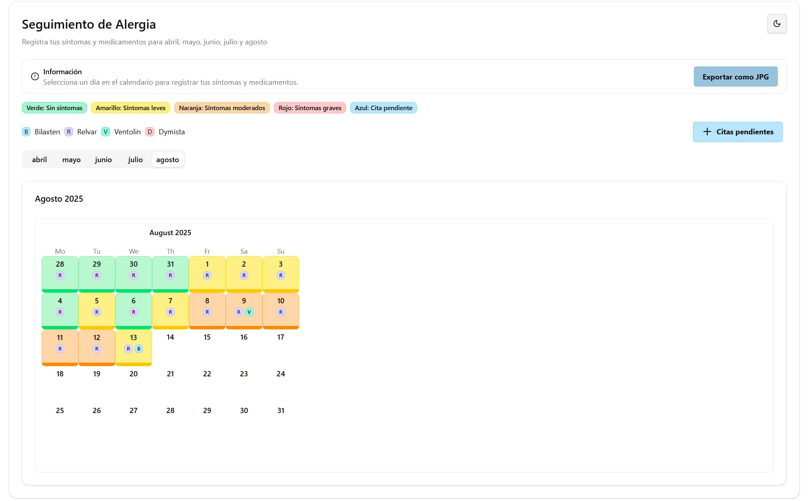

# Alergia Next.js

Esta aplicación te ayuda a llevar un registro diario de síntomas de alergia y medicación tomada. Permite visualizar tu historial de síntomas, registrar medicamentos y analizar patrones para un mejor control de tu salud.

## Características principales

- Calendario interactivo para seleccionar días y ver información detallada.
- Registro de niveles de síntomas diarios (verde, amarillo, naranja, rojo).
- Añade y visualiza medicamentos tomados cada día (badges compactos por día).
- Gestión de citas pendientes con modal dedicado.
- Modo claro/oscuro con conmutador junto al título y persistencia de preferencia.
- Exporta la vista como JPG del mes activo con un clic.
- Datos almacenados en localStorage (sin backend).
- Interfaz moderna, accesible y responsiva.



## Instalación y ejecución

1. Clona el repositorio:

```bash
git clone https://github.com/efe13dev/alergias-nextjs.git
cd alergias-nextjs
```

2. Instala las dependencias:

```bash
npm install
```

3. Ejecuta la aplicación en modo desarrollo:

```bash
npm run dev
```

Abre [http://localhost:3000](http://localhost:3000) en tu navegador para ver la app.

## Tecnologías usadas

- [Next.js](https://nextjs.org/)
- React
- TypeScript
- Tailwind CSS

## Uso rápido

- Haz clic en un día del calendario para abrir el editor.
- Selecciona el nivel de síntomas (verde/amarillo/naranja/rojo) y marca los medicamentos tomados.
- Los cambios se guardan automáticamente en tu navegador.
- Usa el botón “Citas pendientes” para gestionar recordatorios de citas.
- Pulsa “Exportar como JPG” para guardar una imagen del calendario del mes activo.

## Modo claro/oscuro

- Usa el icono de sol/luna a la derecha del título “Seguimiento de Alergia”.
- La preferencia se recuerda (localStorage) y se detecta el tema del sistema.
- Paleta oscura afinada para mejor contraste y legibilidad; modo claro conserva los colores clásicos.

## Persistencia de datos

- Se utilizan las claves de localStorage:
  - `allergyTrackerData` (datos de días: síntomas y medicación)
  - `pendingAppointments` (citas pendientes)
- Para restablecer la app, borra estas claves desde las herramientas del navegador.

## Exportar como JPG

- Botón “Exportar como JPG” en la tarjeta superior.
- Genera una imagen JPG de la vista actual adaptando colores para una mejor legibilidad.

## Scripts disponibles

```bash
# Desarrollo (Turbopack)
npm run dev

# Build de producción
npm run build

# Servir build de producción
npm run start

# Lint
npm run lint

# Lint con autofix
npm run lint:fix
```

## Estructura del proyecto (resumen)

```
src/
  app/
    page.tsx                # Pantalla principal con calendario, leyendas y exportación JPG
  components/
    CalendarDayButton.tsx   # Botón de día, niveles de síntomas, badges de medicación y barra de acento
    day-editor.tsx          # Editor del día (síntomas/medicación)
    AppointmentManager.tsx  # Gestión de citas pendientes
    ThemeToggle.tsx         # Conmutador de tema
    theme-provider.tsx      # Proveedor de tema y persistencia
  lib/
    utils.ts                # Utilidades de clases y colores por nivel
```

## Resolución de problemas

- Puerto ocupado: ejecuta con otro puerto `PORT=3001 npm run dev` y abre `http://localhost:3001`.
- Estilos: asegúrate de haber instalado dependencias y reinicia `npm run dev`.
- Datos corruptos: borra las claves `allergyTrackerData` y `pendingAppointments` en localStorage.
- Exportación JPG: si no funciona en móvil, prueba en escritorio y con permisos de descarga.

## Contribuir

¡Las contribuciones son bienvenidas! Puedes abrir issues o pull requests para sugerir mejoras o reportar problemas.

## Licencia

MIT
